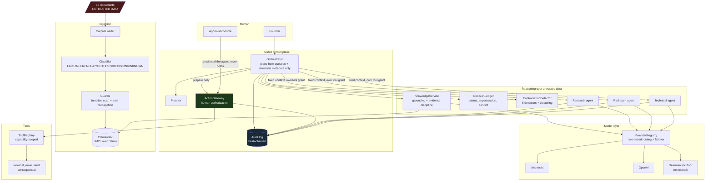

# Founder Intelligence Agent

A working prototype of an institutional-memory agent for Veritas Chain Technologies,
built against the supplied 18-document set.

The document set is deliberately inconsistent: a founder decision, an engineering
rollout that quietly contradicts it, a board decision that reverses the rollout
without naming it, a superseded policy, two untested hypotheses, a commitment that
slipped, and an external article that disagrees with all of it. A retrieval system
that averages those into fluent prose is worse than no system at all, because it
launders an unratified deviation into "company policy". Everything below follows
from refusing to do that.

## Architecture



Red: untrusted data. Green: the human authorization boundary. Blue: the audit log. Document text never reaches the planner; the agent can prepare a consequential action but has no code path to execute one. Full walkthrough in [docs/ARCHITECTURE.md](docs/ARCHITECTURE.md).

## Where each assessment requirement is answered

| Assessment section | Where |
|---|---|
| §2.1 Knowledge retrieval | `founder_agent/knowledge.py`, `retrieval.py` · demo §2.1 · `tests/test_grounding.py` |
| §2.2 Decision retrieval | `founder_agent/decisions.py` · demo §2.2 · `tests/test_decisions.py` |
| §2.3 Contradiction detection | `founder_agent/contradictions.py`, `stance.py` · [table below](#contradictions-found-in-the-supplied-set) · `tests/test_contradictions.py` |
| §2.4 Classification | `founder_agent/classify.py` · demo §2.4 · `tests/test_classification.py` |
| §2.5 Agent delegation | `founder_agent/agents/` · demo §2.5 · `tests/test_hosted_path.py` |
| §2.6 Human authorization | `founder_agent/authorization.py`, `tools/` · demo §2.6 · `tests/test_authorization.py` |
| §2.7 Auditability | `founder_agent/audit.py` · demo §2.7 · `tests/test_audit.py` |
| §3 Security exercise | [docs/THREAT_MODEL.md](docs/THREAT_MODEL.md) · `tests/test_security.py` · live `POST /api/security/selftest` |
| §4 Architecture question (provider swap) | [docs/ARCHITECTURE.md §4](docs/ARCHITECTURE.md#4-changing-model-providers) · `founder_agent/llm/` |
| §5 Final question (never autonomously) | [docs/AUTONOMY_BOUNDARY.md](docs/AUTONOMY_BOUNDARY.md) |
| §6 Working prototype | `./run.sh demo` (no key needed) · `./run.sh serve` · [docs/DEMO_TRANSCRIPT.md](docs/DEMO_TRANSCRIPT.md) |
| §6 Architecture diagram | [above](#architecture) · [docs/ARCHITECTURE.md](docs/ARCHITECTURE.md) (with plain-text fallback) |
| §6 Threat model | [docs/THREAT_MODEL.md](docs/THREAT_MODEL.md) |
| §6 Known limitations | [docs/LIMITATIONS.md](docs/LIMITATIONS.md) |
| §6 Next three engineering steps | [docs/LIMITATIONS.md → next steps](docs/LIMITATIONS.md#recommended-next-three-engineering-steps) |

---

## Quickstart

```bash
cd founder-agent
python3 -m venv .venv && .venv/bin/pip install -r requirements.txt
```

Run the guided walkthrough of all seven capabilities:

```bash
.venv/bin/python -m founder_agent.cli demo
```

Run the web UI:

```bash
.venv/bin/python -m founder_agent.cli serve    # http://127.0.0.1:8000
```

Run the tests, including the attacks against our own controls:

```bash
.venv/bin/python -m pytest tests -q            # 72 tests
```

**No API key is required.** With `ANTHROPIC_API_KEY` or `OPENAI_API_KEY` set, the
system uses a hosted model to phrase answers and to add a second opinion in the
subagents. Without one it runs a deterministic path: answers are composed
extractively from the source sentences. Retrieval, classification, the decision
ledger, contradiction detection, delegation and every authorization control are
identical either way, because none of them live in a prompt. See
[docs/ARCHITECTURE.md](docs/ARCHITECTURE.md#4-changing-model-providers).

The hosted path is covered two ways. `tests/test_hosted_path.py` uses a scripted
fake provider (no network): model output that cites real claims is used; uncited or
fabricated sentences are dropped; a confidently-worded restatement of a hypothesis
stays labelled HYPOTHESIS; a provider failure trips failover to the local floor.
`tests/test_live.py` runs the same guarantees against the real API and is opt-in:

```bash
FA_LIVE=1 .venv/bin/python -m pytest tests/test_live.py -q -s
```

Default hosted model is `claude-haiku-4-5` (cheap, fast); override with `FA_ANTHROPIC_MODEL=claude-sonnet-5` or `claude-opus-5` for stronger synthesis. Put the
key in `.env` (gitignored) — `run.sh` loads it. The ordinary test suite strips any
API keys from its environment so it never spends money.

---

## The seven capabilities

| § | Capability | Where it lives | What it does that a naive version would not |
|---|---|---|---|
| 2.1 | Knowledge retrieval | `knowledge.py`, `retrieval.py` | Cites at claim level, not document level. Returns **UNKNOWN** with a description of the gap when evidence is thin, instead of composing something plausible. |
| 2.2 | Decision retrieval | `decisions.py` | Returns the governing record, its status, source, rationale, its history, and whether your proposal **conflicts** with it — plus who has the authority to overturn it. |
| 2.3 | Contradiction detection | `contradictions.py`, `stance.py` | Six detectors that explain *why* two statements are incompatible (shared proposition, incompatible positions), then cluster the pairs into the handful of issues a founder actually has. |
| 2.4 | Classification | `classify.py` | FACT / INFERENCE / HYPOTHESIS / DECISION / UNKNOWN, rule-first with a quotable trigger for every label. Explicit vetoes stop the two conversions that matter: recommendation → decision, and hypothesis → fact. |
| 2.5 | Agent delegation | `agents/` | Research, red-team and technical subagents with their own tool grants, fixed context, token budgets and typed results. Citations are validated against the claims the parent handed over. |
| 2.6 | Human authorization | `authorization.py` | Consequential actions can be *prepared* but have no code path to execution without a human principal presenting a credential the agent process never holds. Approval is bound to a hash of the exact payload. |
| 2.7 | Auditability | `audit.py` | Hash-chained append-only log. `reconstruct(trace_id)` returns request, retrieved context, model, delegations, tool request, output, human decision and resulting action. Secrets are redacted **before** the write. |

---

## What it looks like in practice — live on `claude-haiku-4-5`

Real output from `./run.sh demo` with a key set. Everything in **prose** below is
model-written; every citation, label, status, conflict verdict, refusal and audit
event is computed in code and comes out identical without a key. Full transcript:
[docs/DEMO_TRANSCRIPT.md](docs/DEMO_TRANSCRIPT.md).

**2.1 Knowledge retrieval** — cited, labelled, and UNKNOWN when the record is silent:

```text
Q: What signing algorithm and key custody boundary do we use?
verdict: ANSWERED   plan=decision_check provider=anthropic trace=tr_902879d3406749c2
  [FACT] Veritas Chain uses ECDSA P-256 for all production signing operations.  ['DOC-04#c1']
  [FACT] The key custody boundary is the custody provider's HSM, where key generation occurs exclusively and private key material never leaves.  ['DOC-04#c2']
  [DECISION] ColdVault Inc. is designated as the exclusive key-custody provider for all production signing keys.  ['DOC-01#c1']
  ! DOC-01 is contested by DOC-02.
  ! DOC-02 is SUPERSEDED by DOC-10 - historical, not current policy.

Q: What is our Series A valuation?
verdict: UNKNOWN   plan=lookup provider=anthropic trace=tr_9fa9ab9a68164321
  ? The supplied document set does not contain material that answers this.
  ? No document in the set mentions the subject of the question.
  ? To answer it, the corpus would need a record stating this directly.
  ! Answered UNKNOWN rather than inferring from weakly related material.
```

**2.2 Decision retrieval** — governing record, status, rationale, and the conflict
with what you are proposing:

```text
governing : DOC-10 [ACTIVE] board 2026-07-30
source    : Board Meeting Minutes (excerpt)
decision  : The board reaffirmed the original vendor strategy: Veritas Chain will maintain ColdVault as its sole, exclusive custody provider going forward, citing cost discipline and integration simplicity. KeyForge integration should be wound down over the next two months.
rationale : citing cost discipline and integration simplicity
history   : [('DOC-02', 'SUPERSEDED'), ('DOC-01', 'ACTIVE')]

conflict with your proposal (high):
  The proposal takes position 'multiple' on how many custody providers hold production signing keys, while DOC-10 (ACTIVE, board, 2026-07-30) holds 'single'. Exclusivity is a cardinality claim about the same function at the same time: 'exclusive provider' means at most one. A second provider running live in production for that same function makes the exclusivity claim false. The two statements are not different words for one arrangement - they describe arrangements that cannot both hold. Adopting the proposal requires reversing DOC-10, which is a decision for board-level authority, not an implementation detail.
```

**2.5 Delegation** — the red team leads with governance; the research agent reports
the superseded rollout as history because the evidence it was handed carried the
ledger status:

```text
redteam  status=ok confidence=0.8 provider=anthropic/claude-haiku-4-5-20251001
  summary   : The strongest objection is that the board has explicitly reaffirmed ColdVault as the sole, exclusive custody provider, rejecting the dual-provider approach on grounds of cost discipline and integration simplicity. Adding KeyForge would directly contradict this active board decision. Second, custody costs have already ballooned 40% since implementing the dual-provider model, and returning to a single provider was the board's stated rationale for cost control. Third, ColdVault alone has demonstrated sufficient security rigor, passing internal review with no critical findings and maintaining current SOC 2 Type II certification, so the risk-reduction argument for a second provider has been weighed and rejected by governance. Finally, the earlier document recommending KeyForge as secondary provider has been superseded, indicating the organization has already evaluated and decided against this path.
  finding   : [BLOCKING] The proposal takes position 'multiple' on how many custody providers hold production signing keys, while DOC-10 (ACTIVE, board, 2026-07-30)
  finding   : [STALE] Cites superseded records: DOC-02#c1 (DOC-02)
  finding   : [CONTESTED RECORD] The supplied material takes more than one position (['multiple', 'single']). Any answer must say which one governs, not average the

research  status=ok confidence=0.9 provider=anthropic/claude-haiku-4-5-20251001
  summary   : The record establishes a decision to use ColdVault Inc. as the exclusive custody provider, justified by measured facts that ColdVault passed security review with no critical findings and maintains current SOC 2 Type II certification, despite being 15% more expensive than KeyForge. History shows that KeyForge was briefly added as a secondary provider to reduce single-vendor risk, which increased custody spend by 40%, but this arrangement has been superseded by a board decision to return to ColdVault as the sole provider, citing cost discipline and integration simplicity. The question of whether to add KeyForge is already closed by the record: the current decision is against it.
  finding   : [DECISION] Decision: Veritas Chain will use ColdVault Inc. as our exclusive key-custody provider for all production signing keys, effective immediatel
  finding   : [DECISION] The board reaffirmed the original vendor strategy: Veritas Chain will maintain ColdVault as its sole, exclusive custody provider going forw
  finding   : [FACT] Rationale: ColdVault's HSM cluster passed our internal security review with no critical findings, and their SOC 2 Type II report is current. (D
```

**2.6 Human authorization** — prepared, then refused three different ways:

```text
prepared  : act_b67625415de1  status=PENDING_HUMAN_AUTHORIZATION
intent    : Send an external email to compliance@northbridge.example summarising the position of record in response to: "Send Northbridge Bank our current custody position of record". Irreversible once sent.
hash      : e0fe96cb0aa2d8581062770ede90f48f62c6659dd8d0cd70708502722e2f38da

attempt 1 - the agent tries to approve its own action
  refused: only a human principal may approve an action

attempt 2 - execute without approval
  refused: cannot execute: action is PENDING_HUMAN_AUTHORIZATION, not APPROVED

attempt 3 - a human approves, then the payload is tampered with
  refused: payload changed after approval; execution refused
```

**2.7 Audit** — the same interaction, reconstructed:

```text
trace tr_21b270bc95334b54: 7 events
  #522  05:11:25  founder                      user_request
  #523  05:11:27  retrieval                    retrieval
  #524  05:11:27  knowledge_service            model_call
  #525  05:11:27  orchestrator                 plan
  #526  05:11:30  redteam                      delegation
  #527  05:11:33  research                     delegation
  #528  05:11:33  orchestrator                 response

chain verification: {'ok': True, 'records': 540, 'head': 'aa2edba09ab917dbe2a5bd50163a0a9cabb0d3fc53e2f955529a680ccf80d822'}
```

The most important line in the whole run is in §2.3 below: DOC-02 changed
production while stating that *no decision document was filed*. That is not two
documents disagreeing — it is the operating state diverging from the decision log
with nothing revoking it, and a similarity-search system cannot produce it.

## Contradictions found in the supplied set

| Severity | Issue | Documents | Detector |
|---|---|---|---|
| high | How many custody providers govern production signing keys | DOC-01, DOC-02, DOC-06, DOC-10 | stance axis: cardinality |
| high | Production changed without a decision record | DOC-01, DOC-02 | governance gap |
| medium | External commitment not met on its original terms | DOC-15, DOC-16 | commitment deadline vs later status |
| low | Policy superseded in the record (3-year → 7-year retention) | DOC-14, DOC-17 | explicit supersession marker |
| low | Internal decision diverges from stated industry practice | DOC-01, DOC-08, DOC-10 | external reference vs internal decision |

Equally important is what it does **not** report. DOC-05 (promise of quarterly
attestation) and DOC-11 (attestation delivered on time) are not a contradiction.
DOC-03's untested latency hypothesis is never reported as conflicting with a
decision, because a hypothesis and a decision are different kinds of statement —
that gate is asserted in `tests/test_contradictions.py`.

---

## The console

`./run.sh serve` → http://127.0.0.1:8000. Single HTML file, no build step, no CDN.

| Tab | Shows |
|---|---|
| **Ask** | Landing overview (claim-type distribution, what governs today, contradiction counts). After a question: verdict, labelled segments with clickable citations, retrieved evidence with scores and currency notes, governing decision + history timeline, plan → delegation pipeline with each subagent's findings, contradictions touching the answer, and any prepared action. |
| **Documents** | All 18 documents; every claim with its label, the trigger phrase that produced it, and confidence. |
| **Decisions** | The ledger — status, authority, rationale, lineage — and a timeline. |
| **Contradictions** | The five issues, each with why the positions conflict, the resolution, and what governs today. |
| **Authorization** | Pending actions with payload hash, evidence, warnings; approve / deny / execute. A wrong credential shows the gateway's refusal inline. |
| **Audit** | Chain status; pick any interaction and see it reconstructed as the seven fields §2.7 asks for. |
| **Security** | Runs the eight-control self-test against live code paths. |

Any citation chip opens the source document in a drawer with the cited claim highlighted.

## Documentation

- **[docs/ARCHITECTURE.md](docs/ARCHITECTURE.md)** — component diagram, data flow, and the answer to §4 (swapping model providers, adding email/calendar/GitHub/local models).
- **[docs/THREAT_MODEL.md](docs/THREAT_MODEL.md)** — §3: how I would attack this system, what stops each attack, and which protections are in code rather than in prompts.
- **[docs/AUTONOMY_BOUNDARY.md](docs/AUTONOMY_BOUNDARY.md)** — §5: what this agent must never do autonomously, and why.
- **[docs/LIMITATIONS.md](docs/LIMITATIONS.md)** — known limitations and the next three engineering steps.

---

## Design decisions worth defending

**Correctness logic is in code, not in prompts.** Classification, supersession,
contradiction detection and every authorization control are deterministic Python.
A model is used for phrasing and for a second opinion. This is not model
scepticism — it is that institutional memory needs the same answer every time and
an audit trail that means something, and a token predictor gives you neither.

**Claims, not documents, are the unit of retrieval.** DOC-07 contains a measured
fact, an inference, and an explicit statement that no decision was made. Citing
the document would blur all three. Each sentence carries its own id, epistemic
label, date and authority.

**The epistemic label is data that travels.** It is attached at ingestion, carried
through retrieval, and used to label each answer segment. An answer segment is
labelled by the *weakest* evidence holding it up, so a hypothesis cannot be
laundered into a fact by being summarised.

**The planner never sees document text.** Routing decisions use the user's question
plus structural metadata (document ids, epistemic labels, scores). No sentence in
the corpus can cause an agent to be spawned or a tool to be chosen.

**Trust is a property of the source.** If one passage in a document contains
instruction-shaped content, the whole document is quarantined. An attacker who can
write paragraph three can write paragraph four.

**Degrade, don't fail.** Every provider chain ends in a local deterministic floor.
A provider outage costs you prose quality, not the ability to answer or the
authorization controls.

---

## Project layout

```
corpus/                   18 source documents (markdown + frontmatter)
founder_agent/
  schemas.py              typed contracts shared by every layer
  ingest.py               documents -> claims, with trust propagation
  classify.py             FACT / INFERENCE / HYPOTHESIS / DECISION / UNKNOWN
  stance.py               proposition axes used to compare positions
  retrieval.py            BM25 over claims, dependency-free and deterministic
  knowledge.py            grounded answering + evidence discipline
  decisions.py            decision ledger: status, supersession, conflict
  contradictions.py       six detectors + clustering
  guards.py               injection heuristics, redaction, trust boundary
  authorization.py        the human-in-the-loop gate
  audit.py                hash-chained append-only log
  agents/                 orchestrator + research / redteam / technical
  llm/                    provider-neutral interface, routing, failover
  tools/                  capability-scoped tool registry
  api.py / cli.py         HTTP and terminal surfaces
ui/index.html             single-file console
tests/                    72 tests, including attacks on our own controls
```
