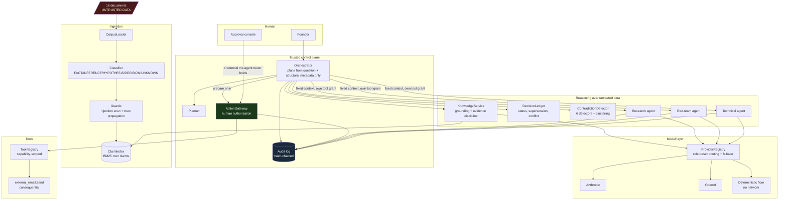

# Architecture

## 1. Component view




<details>
<summary>Same diagram as plain text (for readers without Mermaid)</summary>

```
  18 DOCUMENTS  ── UNTRUSTED DATA ──────────────────────────────────┐
        │                                                           │
        v                                                           │
  ┌─ INGESTION ─────────────────────────────────────────────┐       │
  │  CorpusLoader -> Classifier -> Guards -> ClaimIndex      │       │
  │  (doc -> claims)  (epistemic  (injection  (BM25 over     │       │
  │                    labels)     scan +      claims)       │       │
  │                                taint)                    │       │
  └──────────────────────────┬───────────────────────────────┘       │
                             │ evidence (claim id, label, score)     │
  FOUNDER ──question──> ┌────v─────────────────────────────┐         │
                        │  ORCHESTRATOR                    │         │
                        │  plan  <- question + STRUCTURE    │◄────────┘
                        │           (never document text)  │   no path from
                        └──┬────┬────┬──────────┬──────────┘   text to tools
                           │    │    │          │
             ┌─────────────┘    │    │          └──────────────┐
             v                  v    v                         v
      KnowledgeService   DecisionLedger  ContradictionDetector  SUBAGENTS
      grounding +        status,         6 detectors +          research
      UNKNOWN floor      supersession,   clustering             redteam
             │           conflict              │               technical
             └───────────────┬────────────────-┘                  │
                             v                                    v
                    ┌── MODEL LAYER ────────────────────────────────────┐
                    │ ProviderRegistry: role -> [anthropic, openai, ... ]│
                    │ failover + circuit breaker                        │
                    │ chain always ends at DETERMINISTIC (no network)   │
                    └───────────────────────────────────────────────────┘

                        ORCHESTRATOR ──prepare only──> ActionGateway
                                                            │
   APPROVAL CONSOLE ──credential the agent never holds──────┤
   (human principal)                                        │
                                                            v
                                                   ToolRegistry
                                                   external_email.send
                                                   (consequential)

   EVERY step above writes to the HASH-CHAINED AUDIT LOG, secrets redacted
   before the write, fsync'd before the action it describes may proceed.
```

</details>

## 2. The two boundaries that shape everything

**Boundary 1 — data never becomes instruction.**
Document text enters at ingestion and reaches exactly three places: the BM25 index,
the answer segments shown to the user, and the evidence block inside a subagent
prompt (wrapped in `<untrusted_document>` tags). It never reaches the planner, never
selects a tool, and never carries authority. Routing is computed from the user's own
question plus structural metadata — document ids, epistemic labels, retrieval scores.
This is why a poisoned document in `tests/test_security.py` cannot cause an action:
there is no code path from document text to tool selection.

**Boundary 2 — the agent cannot authorize itself.**
`ActionGateway.prepare()` is agent-callable. `approve()` rejects any principal whose
`kind` is not `"human"` before it looks at anything else, then checks a credential
held by the approval console. Execution re-derives the payload hash and refuses if it
moved since approval. No prompt can cross this, because no prompt is consulted.

## 3. Request lifecycle

```
Founder question
  │
  ├─ audit: user_request
  ├─ retrieval        BM25 over claims  →  evidence with scores + epistemic labels
  │                   quarantine: claims from tainted sources are removed here
  ├─ audit: retrieval (claim ids, scores, types)
  ├─ plan             intent from question wording + retrieval structure
  ├─ audit: plan
  ├─ knowledge        segments, each cited; UNKNOWN if best score < threshold
  ├─ ledger           governing decision, status, history, proposal conflict
  ├─ contradictions   clusters touching the retrieved documents
  ├─ delegation       subagents with fixed context + own tool grants
  │                   audit: delegation (agent, model, tokens, citations, refusals)
  ├─ action?          prepare only → PENDING_HUMAN_AUTHORIZATION
  └─ audit: response  verdict, citations, governing decision, pending action
```

## 4. Changing model providers

> *Assume DTIIL later uses OpenAI models, Anthropic models, Perplexity / research
> services, local models, Email, Calendar, GitHub, internal databases. Explain how
> you would design the system so that changing one model provider does not require
> rebuilding the Founder Agent.*

The Founder Agent is not built on a model. It is built on a set of typed contracts,
and models are one interchangeable implementation behind one of them.

### 4.1 Call sites ask for a role, never a vendor

```python
response = registry.complete("reason", LLMRequest(system=..., messages=[...]))
```

`reason`, `extract`, `research`, `redteam` are capability roles. The mapping from
role to provider chain is configuration:

```bash
FA_ROUTE_REASON=anthropic,openai,deterministic
FA_ROUTE_RESEARCH=perplexity,openai,deterministic
FA_ROUTE_REDTEAM=local-llama,anthropic,deterministic
```

Adding a provider is one class implementing `LLMProvider` (`available()` and
`complete()`), registered with `registry.register(...)`. No call site changes.
`founder_agent/llm/http_providers.py` deliberately uses plain HTTP rather than vendor
SDKs, so a provider change cannot drag a dependency tree behind it.

### 4.2 The response shape is normalised, and provenance is recorded

Every provider returns `LLMResponse` with `text`, `provider`, `model`, token counts
and `degraded`. Those land in the audit record, so an answer can always be traced to
what produced it — including "the local floor produced this, because both hosted
providers were failing at 14:03".

### 4.3 Failover is a property of the chain, not of the caller

A provider that errors is tripped out for a cool-down window; the next in the chain
serves. Every chain ends in `deterministic`, which needs no network. Provider outage
degrades prose quality and nothing else — the `test_system_still_answers_with_no_provider_configured`
and `test_provider_chain_always_ends_in_a_local_floor` tests hold this property.

### 4.4 Nothing load-bearing lives in a provider-specific prompt

This is the part that actually makes providers swappable, and it is a design choice
rather than a layer. Classification, supersession, contradiction detection, evidence
thresholds and every authorization control are deterministic Python. Swapping a
provider cannot change what the system considers a decision, which record governs, or
what needs human approval. If those behaviours lived in a prompt, "swap the provider"
would mean "re-tune and re-validate the institution's memory" — which is the thing to
avoid.

### 4.5 The same shape covers non-model integrations

Email, Calendar, GitHub and internal databases sit behind `ToolRegistry`, which is a
separate boundary with the same properties: a declared capability, an explicit risk
level, a role allow-list, and — for anything consequential — no code path to execution
that does not pass through `ActionGateway`. Adding GitHub means registering a
`ToolSpec`; it does not touch the orchestrator, and a new tool cannot silently acquire
the ability to act on its own, because `requires_human_approval` is checked by the
gateway rather than by the tool.

```
Research services (Perplexity) can be modelled either way:
  - as a provider, when the value is generated text  →  LLMProvider
  - as a tool, when the value is retrieved documents →  ToolSpec, and the
    retrieved text enters the corpus as UNTRUSTED DATA with a provenance
    record, subject to the same quarantine as any other document.
```

The second option is the correct one for external search, and it is the reason
`Claim` carries `authority` — external material is ranked and governed differently
from an internal decision, rather than being poured into the same bucket.

## 5. Storage

The prototype uses append-only files (`var/audit.jsonl`, `var/actions.jsonl`) and an
in-memory index, so it runs with no infrastructure. The interfaces are the ones that
matter for a real deployment:

| Prototype | Production | Why the swap is cheap |
|---|---|---|
| `ClaimIndex` (BM25, in-memory) | pgvector / OpenSearch hybrid | Only `search()` is consumed; the return type is `list[Evidence]`. |
| `AuditLog` (hash-chained JSONL) | append-only table + periodic anchor of the chain head to an external store | Interface is `record()` / `verify()` / `reconstruct()`; the chain design is already what makes an external anchor meaningful. |
| `ActionGateway` (JSONL store) | transactional store with idempotency keys | Status transitions are already explicit and re-validated at execution. |
